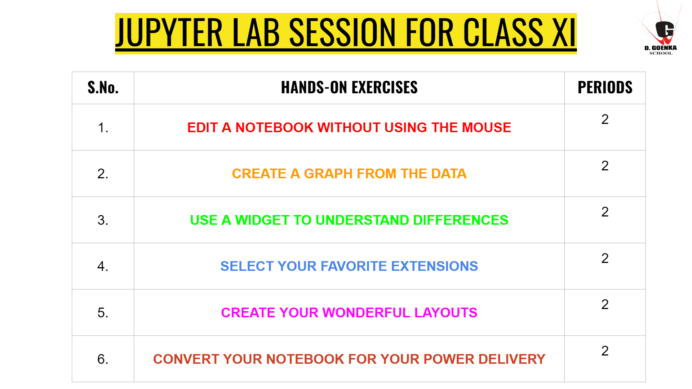

# BOOTCAMP ON JUPYTER LAB/NOTEBOOK

The Jupyter Notebook has been a key platform for data analysts and data scientists for a few years, but it’s now expanding to a more general population, including students, financial analysts, and those in other scientific disciplines. 

Knowing how to run a Jupyter notebook today is just as important as knowing how to use a web browser. 

It’s an essential tool for learning, conveying information, and telling a story.

Join expert Sushil Singh & Deebdeep Bose to learn the basics of the Jupyter Notebook and discover how to use it effectively, including the rapid production and maintenance of cells in your notebooks. 

You’ll leave ready to enhance and customize your notebooks to deliver a proposal, class, or story.

# What you’ll learn and how you can apply it
By the end of this live, hands-on, live class, you’ll understand:

+ How to use the Jupyter Notebook
The format and design of a notebook, advanced interaction, and visualization

### And you’ll be able to:

+ Document and run code in a notebook
+ Install alternate language kernels
+ Make your notebook interactive

## HANDS ON EXERCISE

## TEACHERS NAME

1. SUSHIL SINGH 
2. DEEBDEEP GHOSH
